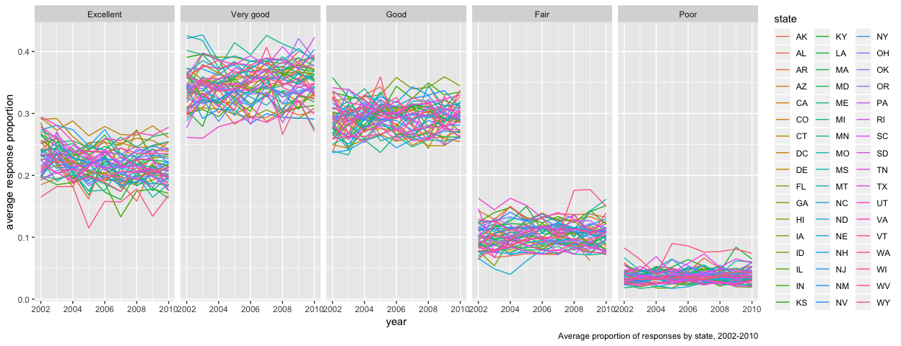
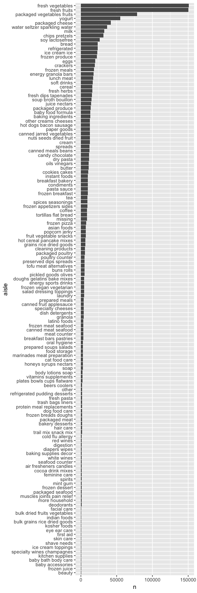

Data Science HW3
================
Nathalie Fadel
10/15/2018

``` r
library(tidyverse)
```

    ## ── Attaching packages ─────────────────────────────────────────────── tidyverse 1.2.1 ──

    ## ✔ ggplot2 3.0.0     ✔ purrr   0.2.5
    ## ✔ tibble  1.4.2     ✔ dplyr   0.7.6
    ## ✔ tidyr   0.8.1     ✔ stringr 1.3.1
    ## ✔ readr   1.1.1     ✔ forcats 0.3.0

    ## ── Conflicts ────────────────────────────────────────────────── tidyverse_conflicts() ──
    ## ✖ dplyr::filter() masks stats::filter()
    ## ✖ dplyr::lag()    masks stats::lag()

``` r
library(p8105.datasets)
library(httr)
library(jsonlite)
```

    ## 
    ## Attaching package: 'jsonlite'

    ## The following object is masked from 'package:purrr':
    ## 
    ##     flatten

``` r
library(patchwork)
```

Problem 1
=========

Data import and cleaning
------------------------

``` r
brfss_smart2010 <- p8105.datasets::brfss_smart2010

brfss_smart2010 = 
  brfss_smart2010 %>%
  janitor::clean_names() %>%
  rename(state = locationabbr, county = locationdesc) %>%
  filter(topic == "Overall Health")

brfss_smart2010$response <- as.factor(brfss_smart2010$response) 
brfss_smart2010$response <- 
  fct_relevel(brfss_smart2010$response, 
    c("Excellent", "Very good", "Good", "Fair", "Poor"))
```

Tables and plots
----------------

``` r
locations <- brfss_smart2010 %>%
  filter(year == "2002") %>%
  distinct(state, county) %>%
  count(state) %>%
  filter(n==7)
```

Connecticut, Florida, and North Carolina all had 7 distinct locations in 2002.

``` r
brfss_smart2010 %>%
  group_by(state, year) %>%
  distinct(county) %>%
  count(state) %>%
  ggplot(aes(x = year, y = n)) +
  geom_line(aes(color = state)) +
  labs(y = "number of locations", caption = "number of locations per state from 2002-2010")
```


``` r
brfss_smart2010 %>%
  janitor::clean_names() %>%
  filter(year %in% c(2002, 2006, 2010), state == "NY", response == "Excellent") %>%
  mutate(p_exc = data_value / 100) %>%
  group_by(year) %>%
  summarize("Avg proportion of excellent response" = mean(p_exc), 
            "Std dev" = sd(p_exc)) %>%
  knitr::kable()
```

|  year|  Avg proportion of excellent response|    Std dev|
|-----:|-------------------------------------:|----------:|
|  2002|                             0.2404000|  0.0448642|
|  2006|                             0.2253333|  0.0400083|
|  2010|                             0.2270000|  0.0356721|

``` r
brfss_smart2010 %>%
  group_by(year, state, response) %>%
  summarize(avg_response = mean(data_value / 100)) %>%
  ggplot(aes(x = year, y = avg_response)) + 
  geom_line(aes(color = state)) +
  labs(y = "average response proportion", 
       caption = "Average proportion of responses by state, 2002-2010") +
  facet_grid(~response)
```

    ## Warning: Removed 1 rows containing missing values (geom_path).



Problem 2
=========

Data cleaning and description
-----------------------------

``` r
instacart_data <- p8105.datasets::instacart %>% 
janitor::clean_names() %>%
mutate(order_dow = order_dow + 1)

days_of_week <- c("Sunday", "Monday", "Tuesday", "Wednesday", "Thursday", "Friday", "Saturday")
instacart_data$order_dow <- days_of_week[instacart_data$order_dow] 
instacart_data$order_dow <- 
  fct_relevel(instacart_data$order_dow, 
    c("Sunday", "Monday", "Tuesday", "Wednesday", "Thursday", "Friday", "Saturday"))
```

This dataset shows the grocery orders made on the website Instacart. It tells us the order IDs, product IDs, user IDs, items chosen, department, aisle, which day of the week and the hour of day that each order was placed. It also shows how long each user went between orders. There are 1384617 observations and 15 variables in the dataset. There are 131209 distinct orders, 39123 distinct products, and 21 distinct departments in this dataset.

I also realized that the dataset had numbered days of the week from 0-6, which doesn't make much intuitive sense. I recoded this to an ordered factor variable, starting at Sunday and ending with Saturday.

``` r
orders <- instacart_data %>%
  group_by(aisle, department) %>%
  summarize(n = n()) %>%
  arrange(desc(n))
```

The aisles with the most orders are fresh vegetables, with 150,609 orders, followed by fresh fruit with 150,473 orders. There are 134 aisles total.

Plots and Tables
----------------

``` r
instacart_data %>%
  group_by(aisle) %>%
  summarize(n = n()) %>%
  arrange(desc(n)) %>%
  mutate(aisle = forcats::fct_reorder(aisle, n)) %>%
  ggplot(aes(x = aisle, y = n)) +
  geom_bar(stat = "identity") +
  coord_flip() 
```



``` r
instacart_data %>%
  filter(aisle %in% 
           c('baking ingredients', 'dog food care', 'packaged vegetables fruits')) %>%
  group_by(aisle, product_name) %>%
  summarize(n = n()) %>%
  arrange(desc(n)) %>%
  filter(min_rank(desc(n)) < 2) %>%
  rename("# of orders" = n, "product name" = product_name) %>%
  knitr::kable()
```

| aisle                      | product name                                  |  \# of orders|
|:---------------------------|:----------------------------------------------|-------------:|
| packaged vegetables fruits | Organic Baby Spinach                          |          9784|
| baking ingredients         | Light Brown Sugar                             |           499|
| dog food care              | Snack Sticks Chicken & Rice Recipe Dog Treats |            30|

The most ordered items in each of these aisles are organic baby spinach, light brown sugar, and Snack Sticks Chicken & Rice Recipe Dog Treats.

``` r
instacart_data %>%
  filter(product_name %in% c("Coffee Ice Cream", "Pink Lady Apples")) %>%
  select(product_name, order_dow, order_hour_of_day) %>%
  group_by(product_name, order_dow) %>%
  summarize(avg_hod = mean(order_hour_of_day)) %>%
  spread(key = order_dow, value = avg_hod) %>%
  knitr::kable()
```

| product\_name    |    Sunday|    Monday|   Tuesday|  Wednesday|  Thursday|    Friday|  Saturday|
|:-----------------|---------:|---------:|---------:|----------:|---------:|---------:|---------:|
| Coffee Ice Cream |  13.77419|  14.31579|  15.38095|   15.31818|  15.21739|  12.26316|  13.83333|
| Pink Lady Apples |  13.44118|  11.36000|  11.70213|   14.25000|  11.55172|  12.78431|  11.93750|

Coffee Ice Cream is usually bought between 12 and 4pm, which overlaps a little with when Pink Lady apples are bought, between 11am and 2pm.

Problem 3
=========

Data cleaning
-------------

``` r
ny_noaa_data <- p8105.datasets::ny_noaa %>%
janitor::clean_names() %>%
  separate(date, c("year", "month", "day"), sep = "-") %>%
  mutate(prcp = prcp / 10, 
         tmax = as.numeric(tmax) / 10,
         tmin = as.numeric(tmin) / 10,
         year = as.integer(year), 
         month = month.name[as.integer(month)])
```

This dataset was quite confusing to decipher at first. Eventually I realized that the precipitation variable was a power of 10 less than what is usually used (tenths of mm, instead of mm). Max and min temps are also in tenths of degrees Celcius. I divided these all by 10 to correct for this. Tmax and tmin were initially character variables, which I had to convert to numeric in order to divide by 10. I also had to make year an integer numeric variable and convert month number to the corresponding month name.

Descriptive stats
-----------------

``` r
x <- ny_noaa_data$snow 
y <- table(x)
names(y)[which(y==max(y))]
```

    ## [1] "0"

This dataset has 2595176 observations and 9 variables. The proportion of missing values is 0.5289595, which is approximately 53%. This is quite a lot of data to be missing, and may render trends that we observe with these numbers to be inaccurate or incomplete compared to the real world. The mean snowfall in this dataset is 4.987025, the median snowfall is 0, the maximum is 1.01610^{4}, and the mode is 0mm. It makes sense that the most frequently observed amount of snowfall is 0mm, as for most of the year in New York, it does not snow.

Plots
-----

``` r
ny_noaa_data %>%
  filter(month %in% c("January", "July")) %>%
  group_by(year, month) %>%
  summarize(avg_high = mean(tmax, na.rm = TRUE)) %>%
  ggplot(aes(x = year, y = avg_high)) +
  geom_line(color = "red") +
  facet_grid(~month)
```


Judging by the graph, average high temperatures in the winter seem to fluctuate more drastically than in the summer, and also from year to year as time goes on. The standard deviation of the average high in July is 4.7489481, whereas in January it is 8.2681917, which is almost twice the standard deviation of July's.

``` r
temps = ny_noaa_data %>%
  filter(!is.na(tmin), !is.na(tmax)) %>%
  ggplot(aes(x = tmin, y = tmax)) +
  geom_bin2d() +
  viridis::scale_fill_viridis(option = "inferno") +
  theme(legend.position = "bottom", legend.key.size = unit(1.25, "cm"))

snowfall = ny_noaa_data %>% 
  filter(snow > 0, snow < 100) %>% 
  mutate(year = as.factor(year)) %>%
  ggplot(aes(x = snow, color = year)) + 
  geom_density(alpha = .05) + 
  viridis::scale_color_viridis(name = "year", discrete = TRUE, option = "inferno") +
  labs(x = "snowfall (mm)") 

temps + snowfall 
```


